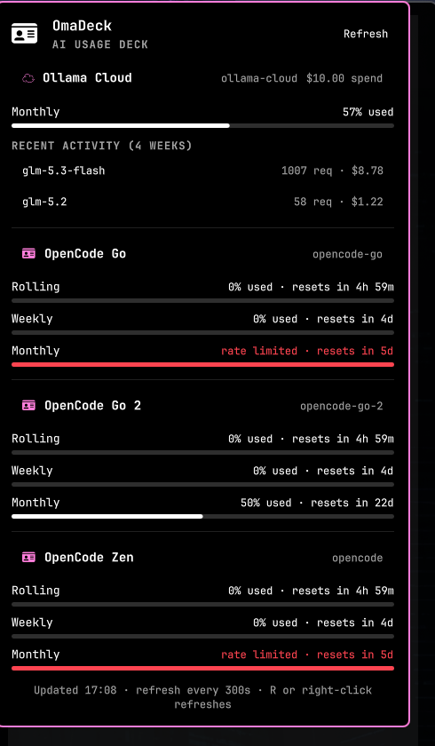

# OmaDeck

**AI usage deck for the Omarchy bar** — live "percent used" meters and reset
countdowns for your AI provider accounts, ModelDeck-style, in a bar widget
and dropdown panel.



OmaDeck watches the provider accounts you have already signed into with
[opencode](https://opencode.ai) and shows, per account, every rate-limit
window the provider reports:

- **OpenCode Zen accounts** (`opencode*` keys) — rolling, weekly, and
  monthly windows with exact reset times ("resets in 4h 59m", "rate
  limited · resets in 5d").
- **Ollama Cloud** — monthly usage percent, last-4-weeks spend, and a
  per-model request/cost breakdown.

The **bar** shows the deck glyph plus the worst window's percentage,
colour-coded: plain when healthy, accent at your warn threshold, red at
critical. The **panel** (left-click) lists one card per account with
meters and countdowns. Right-click forces a refresh.

## Install

```sh
omarchy plugin add https://github.com/LinuxGamerUK/omadeck.git --enable
```

Then place it where you like:

```sh
omarchy bar move com.github.linuxgameruk.omadeck --section right
```

## Remove

```sh
omarchy plugin remove com.github.linuxgameruk.omadeck
```

## Requirements

- Omarchy Quattro (quickshell shell) — tested against Quattro's plugin
  contract (`schemaVersion: 1`).
- **Python 3** and **curl** — both ship with Arch/Omarchy; no extra
  packages, no AUR builds, nothing downloaded at runtime.
- At least one signed-in provider account (see below).

## How account detection works (provider-agnostic design)

OmaDeck does **not** ship a list of subscriptions or hardcode your
accounts. On every refresh it scans **one local file**:

```
~/.local/share/opencode/auth.json
```

This is the credential store `opencode auth login` maintains. Every
account entry whose name starts with `opencode` is polled as an OpenCode
Zen account; an entry named `ollama-cloud` is polled as Ollama Cloud.
That means:

- **Multiple subscriptions work out of the box.** If you have two Zen
  plans, a Go plan, and Ollama Cloud — each key in `auth.json` becomes
  its own card. OmaDeck found four accounts on the machine it was built
  on without any configuration.
- **New accounts appear on the next refresh.** Sign in once with
  `opencode auth login`, and the deck picks the key up automatically.
- **Unknown OpenCode account names** (future plans like `opencode-go-3`)
  still match the `opencode*` prefix and get a readable label derived
  from the account name.
- **Accounts you're not subscribed to simply don't appear** — detection
  is a local scan of keys you actually hold, not a probe of provider
  catalogs.

What it deliberately does **not** support yet: Claude Code
(`~/.claude`) and Codex CLI (`~/.codex`) subscriptions. Those CLIs store
credentials differently (no `auth.json`), and native usage endpoints
differ per provider; if and when they're added, they will follow the
same local-scan + per-provider-adapter pattern. Everything else about
the deck (meters, thresholds, countdowns, cards) is provider-agnostic
by design.

If you have no supported keys, the widget dims and the panel tells you
exactly what to do:

```sh
opencode auth login   # pick OpenCode Zen or Ollama Cloud
```

## Usage

| Action | Result |
|---|---|
| Left-click | Toggle the usage deck panel |
| Right-click | Refresh now |
| `R` in panel | Refresh now |
| Esc | Close panel |

Scriptable IPC:

```sh
omarchy-shell com.github.linuxgameruk.omadeck toggle
omarchy-shell com.github.linuxgameruk.omadeck open
omarchy-shell com.github.linuxgameruk.omadeck refresh
```

## Settings

Configured from Omarchy's bar settings (widget settings form):

| Setting | Default | Meaning |
|---|---|---|
| Refresh interval (s) | 300 | Poll cadence, 60–3600 |
| Warn threshold (%) | 80 | Bar text turns accent at/above |
| Critical threshold (%) | 95 | Bar turns red at/above |
| Bar shows | `worst` | `worst` = worst window %, `none` = glyph only |
| Show Ollama spend | on | Ollama cost + model activity cards |

## Privacy & security

- **Local-first.** The only network traffic is HTTPS GET to
  `https://opencode.ai/zen/go/v1/usage` and `https://ollama.com/api/usage`
  — the providers whose keys you already hold. No other hosts, no
  telemetry, no update checks, no downloads.
- **Keys never appear in process arguments.** Account discovery reads
  `auth.json` locally; each key is then piped to `curl` **over stdin**,
  where bash parks it in a `0600` temp file under `$XDG_RUNTIME_DIR`
  that is deleted on exit (`trap`), well under a second later. No key is
  ever in argv, `/proc/*/cmdline`, or any repo file.
- **No privileged operations.** No `sudo`, no `pkexec`, no system
  services, no config files written anywhere. The plugin runs entirely
  as your user.
- **No runtime code execution from outside.** Nothing is cloned, built,
  fetched, or executed beyond the two hardcoded API GETs and the local
  discovery script.
- **Bounded I/O everywhere.** Every subprocess runs under
  `timeout -k 2 N` (process-group kill) plus a QML watchdog fallback;
  every output stream is capped at the OS pipe level
  (`set -o pipefail; … | head -c N`) before parsing; parsed collections
  (accounts, windows, model rows, buffers) have fixed caps; output is
  parsed only on `exitCode === 0`; every string from an external source
  is sanitized (`<>&`) and rendered with `Text.PlainText`.
- **Failures are actionable.** Missing keys, timeouts, truncations, and
  per-account errors are surfaced by name in the panel instead of a bare
  "failed".

## Dependencies

- `python3` (discovery; base Arch install)
- `curl` (API polling; base Arch install)
- Omarchy Quattro shell with Quickshell

## License

MIT — see [LICENSE](LICENSE).

## Acknowledgements

Inspired by [ModelDeck](https://github.com/timharris707/modeldeck)
(macOS menu-bar usage deck). OmaDeck is an independent implementation
for Omarchy/Quickshell — no code shared.